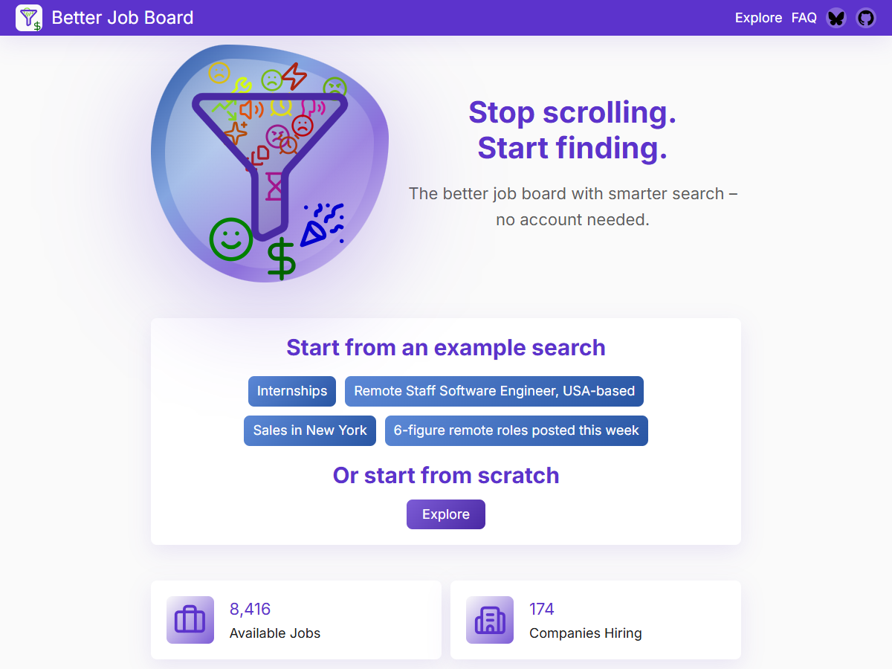
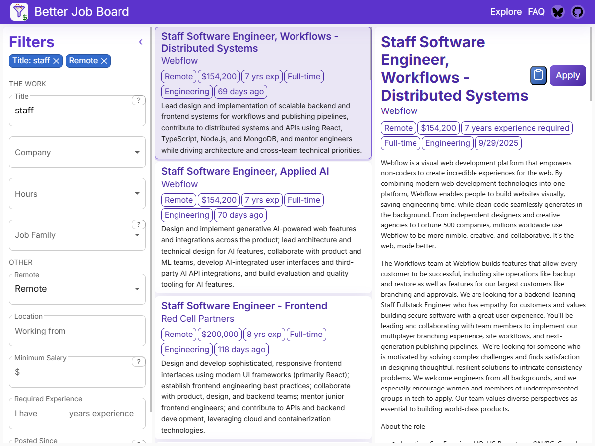
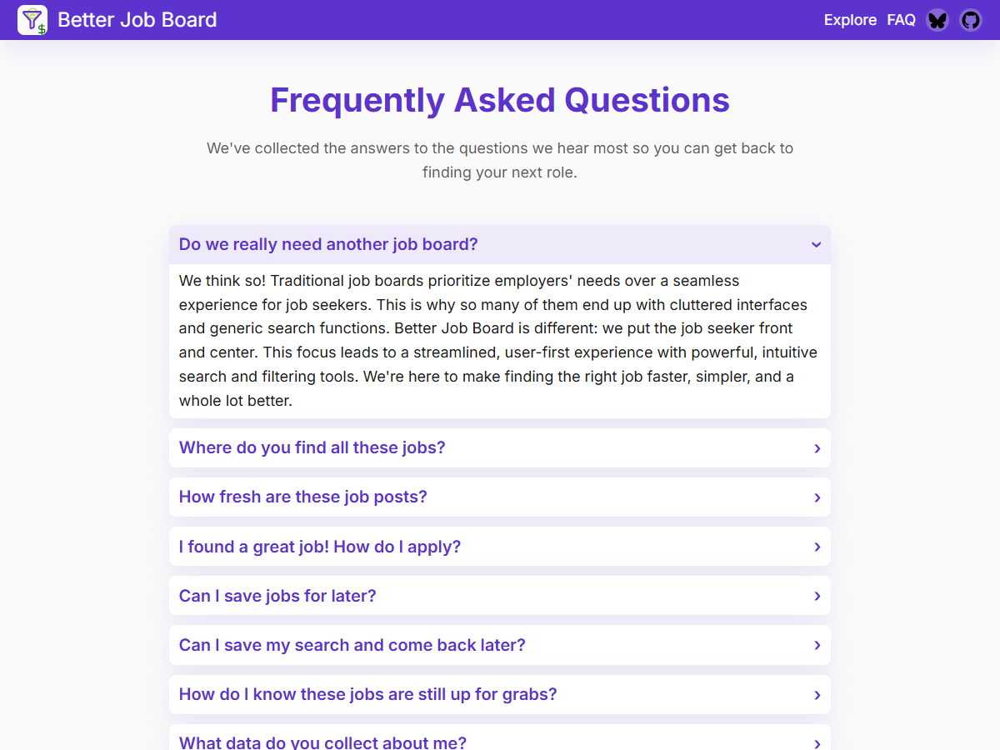

# Job Board

Next-generation job board focused on the job seeker experience. The monorepo houses the Vite/Vanilla frontend, an Express 5 + TypeScript API, a TypeScript admin CLI, and an evaluation harness for the LLM-powered extraction logic.

> Status: active development. Expect breaking changes as the product evolves.

## Problem Statement

Traditional job boards face significant challenges in providing an efficient and effective platform for job seekers:

1. **Misaligned Incentives**: Job boards prioritize employer needs over job seeker experience due to their revenue model. This inevitably leads to feature bloat, poor user experience for job seekers, and escalating operational costs.
2. **Data Difficulties**: Job information in Applicant Tracking Systems (ATS) lack rich metadata. This makes it prohibitively expensive for job boards to provide more than basic search and filtering capabilities, which in turn leads to difficulty in matching candidates to relevant positions and an inefficient job discovery process.

## The LLM Opportunity

Large Language Models (LLMs) offer a transformative solution to these long-standing issues:

1. **Lean Development**: LLM-assisted development enables smaller teams to build sophisticated platforms, which in turn reduces operational costs significantly. This changes the economics, allowing for a job board that focuses squarely on the job seeker.
2. **Enhanced Data Processing**: LLMs can extract rich metadata from unstructured job descriptions. This enables advanced search and filtering possibilities, both using traditional methods and based on semantic understanding.

## Project Goal

Our aim is to create a next-generation job board that prioritizes the job seeker's experience while maintaining operational efficiency. By addressing the core issues of traditional platforms, we seek to transform how people discover and apply for jobs.

## At a Glance

- **Workspaces**
  - [`packages/backend`](packages/backend/README.md): Express 5 + TypeScript API that integrates with Azure Cosmos DB and ATS providers, exposing REST routes under `/api`.
  - [`packages/frontend`](packages/frontend/README.md): Current Vite/Vanilla frontend with server-side wrapper for production hosting.
  - [`packages/admin`](packages/admin/README.md): TypeScript CLI for administrative operations such as adding/deleting companies from supported ATS providers.
  - [`packages/evals`](packages/evals/README.md): Local evaluation harness that mirrors backend LLM extraction logic against curated datasets.
- **Prerequisites**: Node.js 24+, Azure Cosmos DB Emulator or an Azure Cosmos DB account.
- **Install once from the repo root**: `npm install`
- **Dev servers**: `npm run start:backend` and `npm run start:frontend`

## Getting Started

0. Prerequisites:
   - [Node.js 24+](https://nodejs.org/en/download/)
   - [Azure CosmosDB Emulator](https://learn.microsoft.com/en-us/azure/cosmos-db/local-emulator) or [Azure CosmosDB Account](https://azure.microsoft.com/en-us/services/cosmos-db/)
1. Install dependencies:
   ```bash
   npm install
   ```
2. Configure environment variables:
   - Each workspace uses its own `.env` file. Consult the individual package READMEs for required keys.
   - For local Cosmos DB development, follow the instructions below to set up the emulator and export its certificate.

### Local CosmosDB Emulator

CosmosDB has a local emulator that you can use for development. These instructions have been used on a direct-install emulator on Windows 10. A similar process should work on other versions of Windows or using the Docker-hosted emulator.

- Install the [Azure CosmosDB Emulator](https://learn.microsoft.com/en-us/azure/cosmos-db/how-to-develop-emulator)
- Export the Azure CosmosDB Emulator certificate
  - Open the Windows Certificate Manager
  - Navigate to `Trusted Root Certification Authorities` > `Certificates`
  - Find the certificate for Issued To: `localhost`, Friendly Name: `DocumentDbEmulatorCertificate`
  - Right-click the certificate and select `All Tasks` > `Export...`
  - No, do not export the private key
  - Base-64 encoded X.509 (.CER)
  - Save the file to `packages\backend\cosmosdbcert.cer`

## Common Scripts

Most commands are exposed via the root `package.json`:

| Task                                | Command                              |
| ----------------------------------- | ------------------------------------ |
| Start the backend API in watch mode | `npm run start:backend`              |
| Launch the frontend                 | `npm run start:frontend`             |
| Build the backend for production    | `npm run build --workspace=backend`  |
| Build the frontend for production   | `npm run build --workspace=frontend` |

Refer to package-specific READMEs for additional scripts such as previews, linting, and
production server wrappers.

## Admin CLI

The admin CLI provides scripted access to backend operations. Invoke it from the repo root as:

```bash
npm run admin -- <command> [args]
```

Configure `PROD_API_TOKEN` and `LOCAL_API_TOKEN` (and their corresponding base URLs if not using defaults) in `packages/admin/.env` (or your shell)
before invoking the CLI. Available commands include importing companies from Greenhouse or
Lever and deleting individual job postings.

## Evaluation harness

The evaluation workspace reproduces the backend’s extraction logic locally. After preparing
input and ground-truth data under `packages/evals/`, run:

```bash
npm run eval -- evals <dataModel> [runName]
```

Outputs are written beside the source data (inputs, ground truth, outcomes, and reports)
to support reproducible experiments when tuning LLM configuration.

## Screenshots

UI Snapshots from December 8, 2025

### Home Page



### Explore Page



### FAQ Page


