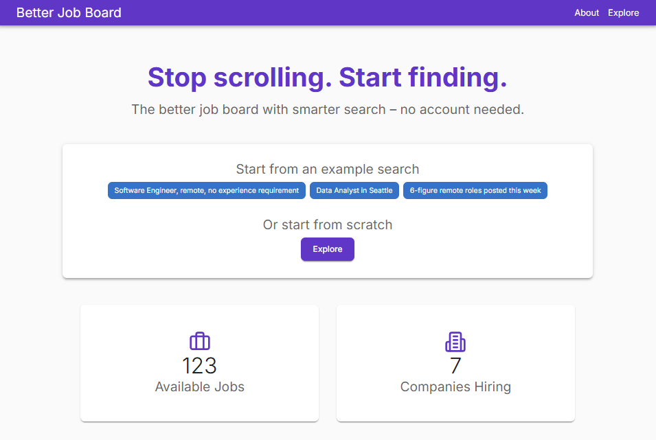

# Job Board

Caution: This project is in the early stages of development. It is not yet ready for production use. This README is likely out of date.

## Problem Statement

Traditional job boards face significant challenges in providing an efficient and effective platform for job seekers:

1. **Misaligned Incentives**: Job boards prioritize employer needs over job seeker experience due to their revenue model. This inevitably leads to feature bloat, poor user experience for job seekers, and escalating operational costs.
2. **Data Difficulties**: Job information in Applicant Tracking Systems (ATS) lack rich metadata. This makes it prohibitively expensive for job boards to provide more than basic search and filtering capabilities, which in turn leads to difficulty in matching candidates to relevant positions and an inefficient job discovery process.

## The LLM Opportunity

Large Language Models (LLMs) offer a transformative solution to these long-standing issues:

1. **Lean Development**: LLM-assisted development enables smaller teams to build sophisticated platforms, which in turn reduces operational costs significantly. This changes the economics, allowing for a job board that focuses squarely on the job seeker.
2. **Enhanced Data Processing**: LLMs can extract rich metadata from unstructured job descriptions. This enables advanced search and filtering possibilities, both using traditional methods and based on semantic understanding.

## Project Goal

Our aim is to create a next-generation job board that prioritizes the job seeker's experience while maintaining operational efficiency. By addressing the core issues of traditional platforms, we seek to transform how people discover and apply for jobs.

## Repository Structure

The monorepo uses npm workspaces. Each package ships its own README with deeper setup instructions; the summaries below highlight the role of every workspace.

| Package                                            | Description                                                                                                                                                               |
| -------------------------------------------------- | ------------------------------------------------------------------------------------------------------------------------------------------------------------------------- |
| [`packages/backend`](packages/backend/README.md)   | Express 5 + TypeScript API service that connects to Azure Cosmos DB, integrates with ATS providers, and exposes REST routes under `/api`.                                 |
| [`packages/frontend`](packages/frontend/README.md) | Current production vanilla HTML/CSS/JS frontend built with Vite. Proxies API calls to the backend during development and ships an Express wrapper for production hosting. |
| [`packages/admin`](packages/admin/README.md)       | TypeScript CLI for administrative actions such as importing companies from supported ATS providers or deleting job posts.                                                 |
| [`packages/evals`](packages/evals/README.md)       | Local evaluation harness that exercises the backend LLM extraction logic against curated scenarios and produces reports.                                                  |

## Prerequisites

- [Node.js 24+](https://nodejs.org/en/download/)
- [Azure CosmosDB Emulator](https://learn.microsoft.com/en-us/azure/cosmos-db/local-emulator) or [Azure CosmosDB Account](https://azure.microsoft.com/en-us/services/cosmos-db/)

Install workspace dependencies once from the repository root:

```bash
npm install
```

### Local CosmosDB Emulator

CosmosDB has a local emulator that you can use for development. These instructions have been used on a direct-install emulator on Windows 10. A similar process should work on other versions of Windows or using the Docker-hosted emulator.

- Install the [Azure CosmosDB Emulator](https://learn.microsoft.com/en-us/azure/cosmos-db/how-to-develop-emulator)
- Export the Azure CosmosDB Emulator certificate
  - Open the Windows Certificate Manager
  - Navigate to `Trusted Root Certification Authorities` > `Certificates`
  - Find the certificate for Issued To: `localhost`, Friendly Name: `DocumentDbEmulatorCertificate`
  - Right-click the certificate and select `All Tasks` > `Export...`
  - No, do not export the private key
  - Base-64 encoded X.509 (.CER)
  - Save the file to `packages\backend\cosmosdbcert.cer`

### Environment configuration

Workspaces require their own .env files. Review package READMEs for specific variables.

## Running the applications

Most scripts are exposed through the root `package.json`:

| Task                                            | Command                              |
| ----------------------------------------------- | ------------------------------------ |
| Start the backend API in watch mode             | `npm run start:backend`              |
| Launch the current frontend (packages/frontend) | `npm run start:frontend`             |
| Build the backend for production                | `npm run build --workspace=backend`  |
| Build the current frontend                      | `npm run build --workspace=frontend` |

Refer to each package README for additional scripts such as previews, linting, or production
server wrappers.

## Administrative tooling

The admin CLI provides scripted access to backend operations. Run commands from the repository
root by prefixing them with the workspace script:

```bash
npm run admin -- <command> [args]
```

Configure `ADMIN_API_BASE_URL` and `ADMIN_API_TOKEN` in `packages/admin/.env` (or your shell)
before invoking the CLI. Available commands include importing companies from Greenhouse or
Lever and deleting individual job postings.

## Evaluation harness

The evaluation workspace reproduces the backend’s extraction logic locally. After preparing
input and ground-truth data under `packages/evals/`, run:

```bash
npm run eval -- <dataModel> [runName]
```

The script stores model outputs and metrics beside the source data, enabling reproducible
experiments when tuning LLM configuration.

## In-Progress Screenshots

Screenshot of the current UI. We have a ways to go.

### Home Page



### Explore Page


### About Page


